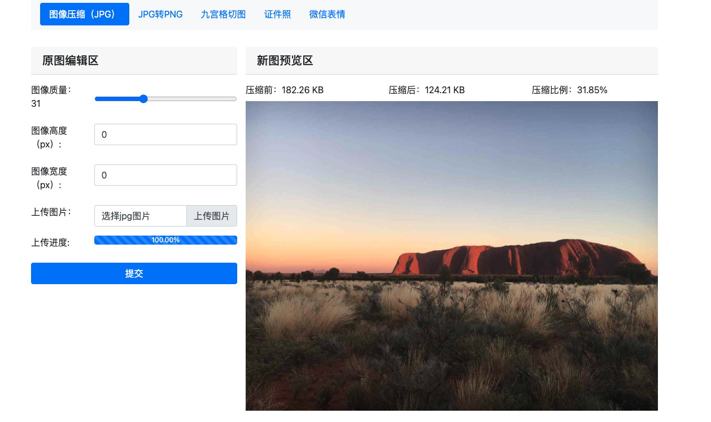

# image-process
一个简单的图像处理服务。

## 主要技术栈
- Flask
- Bootstrap V4.6
- gunicorn
- Pillow


## 效果图


## 安装
1. 将Python版本切换到3.10x及以上；
2. 在命令行中输入以下命令安装依赖：
   ``` shell
   pip install -r requirements.txt
   ```
3. 安装完成后，在命令行中输入：
   ```shell
   sh run.sh
   ```
4. 在浏览器打开：`http://127.0.0.1:8000` 即可看到主页。